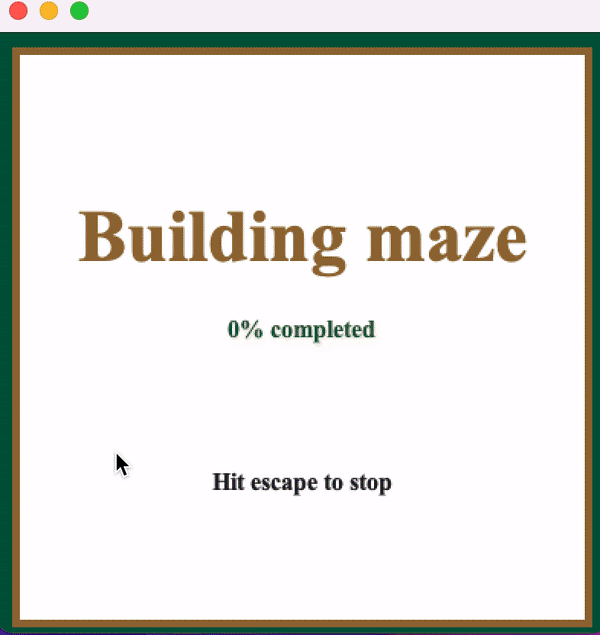

# Maze Generating and Playing Application

This Java project allows for the generation and traversal of mazes with both graphical 3D and 2D interfaces. It inherits groundwork code from a class project and includes additional features:

* Various Robot traversal options with multiple algorithms for maze solving.
* Implementation of robot sensors using multithreading, simulating varying reliability.
* Faulty sensors that intermittently fail, requiring repair before resuming traversal.
* Maze generation using the Boruvka, Prim, and DFS  algorithmsvv.
* Command line options for selecting robot algorithms, sensor configurations, maze building types, and manual vs. automated playing.

## Features
* **Robot Traversal**: Navigate the maze using a robot with multiple traversal algorithms.
* **Sensor Simulation**: Experience intermittent sensor failures and repair functionality.
* **Maze Generation**: Create mazes using Boruvka's algorithm.
* **Command Line Options**: Customize robot behavior, sensor reliability, maze generation, and gameplay modes.

## Gameplay
<p align="center">
  
  
</p>


## How to Run
1. Ensure you have Java JDK installed on your system.
2. Clone or download the project from the GitLab repository.
3. Import the project into your preferred Java IDE (e.g., Eclipse).
4. Compile and run the `Control.java` file to start the application.
5. Use command line parameters to customize the gameplay experience.

## Run Configurations

- **Convenient Setup**: Pre-configured run configurations for different scenarios, including default, Prim, file input, and Boruvka.
- **Assertions Enabled**: VM arguments set to enable assertions for debugging purposes.

## Deterministic Maze Generation

- **Development Mode**: Users can toggle between deterministic and non-deterministic maze generation.
- **Controlled Randomness**: Allows for consistent maze generation during development and debugging.

## Command Line Options
* `-algorithm <algorithm>`: Specify the robot traversal algorithm (e.g., "DFS", "BFS", "A*").
* `-sensors <sensors>`: Choose sensor configurations (e.g., "faulty", "reliable", "mixed").
* `-maze <algorithm>`: Select the maze generation algorithm (e.g., "Boruvka", "Prim").
* `-mode <mode>`: Set the gameplay mode ("manual" or "automated").

## Example Usage

```
java Control -g Prim -r 0001 -d Wallfollower
```

This command runs the application with Prim's algorithm for maze generation, North, East, and South unreliable robot sensors "0001", and the Wallfollower algorithm for robot traversal.


## Test Coverage

- **JUnit Test Cases**: Extensive test coverage for MazeBuilder and MazeBuilderBoruvka classes.
- **Black Box and White Box Testing**: Tests cover both functional and implementation-specific aspects of the algorithms.

